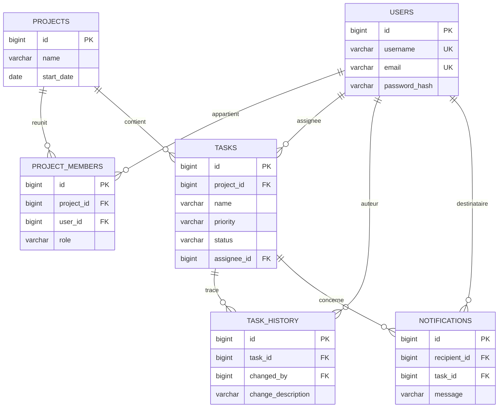

# Project Management Tool (PMT)

Plateforme collaborative de gestion de projets developpee dans le cadre de l'etude de cas
RNCP Niveau 7 — *Expert en Ingenierie du Logiciel* (bloc « Integration, industrialisation et deploiement »).

- **Frontend** : Angular 18 (composants standalone, HttpClient, routing)
- **Backend** : Spring Boot 3.3 (architecture en couches controleur → service → repository, DTO, Spring Data JPA)
- **Base de donnees** : PostgreSQL
- **Tests** : JUnit 5 + Mockito + JaCoCo (backend), Jest (frontend) — couverture ≥ 60 % (instructions et branches)
- **Industrialisation** : Dockerfiles dedies, `docker-compose`, pipeline GitHub Actions avec push des images sur Docker Hub

> L'authentification se fait par e-mail / mot de passe (mot de passe chiffre en BCrypt).
> Conformement a l'enonce, Spring Security n'est pas active : l'utilisateur courant est transmis
> au backend via l'en-tete HTTP `X-User-Id`.

---

## 1. Architecture

```
pmt/
├── backend/      API REST Spring Boot (Maven)
├── frontend/     Application Angular (Jest)
├── db/           Schema relationnel + donnees de test + diagramme
├── docker-compose.yml
└── .github/workflows/ci-cd.yml
```

### Modele relationnel



### Roles et permissions (par projet)

| Action                                   | ADMIN | MEMBER | OBSERVER |
|------------------------------------------|:-----:|:------:|:--------:|
| Inviter un membre / changer un role      |  ✅   |   ❌   |    ❌    |
| Creer / assigner / modifier une tache    |  ✅   |   ✅   |    ❌    |
| Visualiser taches, tableau de bord       |  ✅   |   ✅   |    ✅    |
| Historique et notifications              |  ✅   |   ✅   |    ✅    |

Le createur d'un projet en devient automatiquement **administrateur**.

---

## 2. Prerequis

- **Docker** et **Docker Compose** (déploiement conteneurise — recommande)
- Pour le developpement local : **JDK 17+**, **Maven 3.8+**, **Node.js 22+**, **PostgreSQL 16** (optionnel)

---

## 3. Deploiement avec Docker (recommande)

A la racine du projet :

```bash
docker compose up --build
```

Cette commande :
1. demarre **PostgreSQL** et initialise la base avec `db/schema.sql` puis `db/data.sql` (donnees de test) ;
2. construit et lance le **backend** (image multi-stage Maven → JRE) ;
3. construit et lance le **frontend** (build Angular servi par nginx, qui relaie `/api` vers le backend).

| Service   | URL                              |
|-----------|----------------------------------|
| Frontend  | http://localhost:4200            |
| Backend   | http://localhost:8080/api        |
| Swagger   | http://localhost:8080/swagger-ui.html |
| PostgreSQL| localhost:5432 (`pmt` / `pmt`)   |

**Comptes de demonstration** (mot de passe : `password123`) :
`alice@pmt.local` (ADMIN), `bob@pmt.local` (MEMBER), `carol@pmt.local` (OBSERVER).

Arret : `docker compose down` (ajouter `-v` pour supprimer aussi le volume de donnees).

### Variables d'environnement

| Variable                     | Service  | Defaut                                   | Role |
|------------------------------|----------|------------------------------------------|------|
| `SPRING_DATASOURCE_URL`      | backend  | `jdbc:postgresql://db:5432/pmt`          | URL JDBC PostgreSQL |
| `SPRING_DATASOURCE_USERNAME` | backend  | `pmt`                                    | Utilisateur BD |
| `SPRING_DATASOURCE_PASSWORD` | backend  | `pmt`                                    | Mot de passe BD |
| `JPA_DDL_AUTO`               | backend  | `update`                                 | Strategie Hibernate |
| `PMT_CORS_ALLOWED_ORIGINS`   | backend  | `http://localhost:4200`                  | Origines CORS autorisees |
| `PMT_MAIL_ENABLED`           | backend  | `false`                                  | Envoi reel des e-mails (sinon journalises) |
| `DOCKERHUB_USERNAME`         | compose  | `local`                                  | Prefixe des images Docker |

---

## 4. Developpement local (sans Docker)

### Backend

```bash
cd backend
# Necessite un PostgreSQL accessible (voir variables ci-dessus), ou adapter application.properties
mvn spring-boot:run
```

### Frontend

```bash
cd frontend
npm install
npm start        # http://localhost:4200
```

En developpement, configurer le proxy Angular ou pointer `API_BASE_URL` vers `http://localhost:8080/api`.

---

## 5. Tests et couverture

### Backend (JUnit 5 / Mockito / JaCoCo)

```bash
cd backend
mvn clean verify
```

Le build echoue si la couverture descend sous 60 % (instructions **et** branches).
Rapport HTML : `backend/target/site/jacoco/index.html`.

### Frontend (Jest)

```bash
cd frontend
npm run test:coverage
```

Seuils de couverture fixes a 60 % dans `jest.config.js`.
Rapport : `frontend/coverage/lcov-report/index.html`.

---

## 6. Integration et deploiement continus

La pipeline `.github/workflows/ci-cd.yml` s'execute a chaque push :

1. **backend** : `mvn clean verify` (compilation, tests, controle de couverture JaCoCo) ;
2. **frontend** : `npm ci`, `npm run test:coverage`, `npm run build` ;
3. **docker** (branche `main` uniquement) : construction des images backend et frontend et **push sur Docker Hub**.

### Secrets a configurer dans le depot GitHub

`Settings → Secrets and variables → Actions` :

| Secret               | Description                               |
|----------------------|-------------------------------------------|
| `DOCKERHUB_USERNAME` | Identifiant Docker Hub                     |
| `DOCKERHUB_TOKEN`    | Jeton d'acces Docker Hub (Account Settings → Security) |

Les images publiees sont `:<username>/pmt-backend` et `:<username>/pmt-frontend` (tags `latest` et SHA du commit).

---

## 7. Principaux points d'API

| Methode | Endpoint                                   | Description |
|--------|--------------------------------------------|-------------|
| POST   | `/api/auth/register`                        | Inscription |
| POST   | `/api/auth/login`                           | Connexion |
| POST   | `/api/projects`                             | Creer un projet (createur = ADMIN) |
| GET    | `/api/projects`                             | Mes projets |
| POST   | `/api/projects/{id}/members`                | Inviter un membre (ADMIN) |
| PUT    | `/api/projects/{id}/members/{memberId}/role`| Changer un role (ADMIN) |
| POST   | `/api/projects/{id}/tasks`                  | Creer une tache (ADMIN/MEMBER) |
| GET    | `/api/projects/{id}/dashboard`              | Tableau de bord par statut |
| PUT    | `/api/tasks/{id}`                           | Modifier une tache (ADMIN/MEMBER) |
| PATCH  | `/api/tasks/{id}/assignee`                  | Assigner une tache |
| GET    | `/api/tasks/{id}/history`                   | Historique des modifications |
| GET    | `/api/notifications`                        | Notifications de l'utilisateur |

Tous les appels (hors inscription/connexion) attendent l'en-tete `X-User-Id`.
